# PULSE: Comprehensive Architecture & Operational Specification Report

---

## 1. Executive System Architecture

**PULSE** (*Predictive Universal Lightweight Security Engine*) is a unified vulnerability intelligence, attack surface management, and safe remediation CLI. It bridges open-source package ecosystem advisories with official NIST/NVD standards, empirical threat metrics (EPSS, CISA KEV), exploit intelligence (PoCs), and MITRE ATT&CK adversary tactics.

```mermaid
flowchart TD
    subgraph INPUT ["1. Target Ingestion"]
        A1[Target Package / Version]
        A2[Project Manifest / Lockfile]
        A3[System Auto-Discovery]
        A4[Website URL]
    end

    subgraph RESOLUTION ["2. Disambiguation & Fingerprinting"]
        B1[Package Disambiguator & Registries]
        B2[Declarative Website Fingerprint Engine]
    end

    subgraph MATCHING ["3. Dual Vulnerability Engine"]
        C1[Google OSV API v1 Engine]
        C2[NIST NVD 2.0 & CPE 2.3 Correlator]
    end

    subgraph NORMALIZATION ["4. Identifier Normalization"]
        D1[Extract Canonical CVE ID]
        D2[Normalize Advisory Aliases / Upstream]
    end

    subgraph ENRICHMENT ["5. Threat & Exploit Intelligence"]
        E1[FIRST EPSS Probability & Percentile]
        E2[CISA KEV Catalog Matcher]
        E3[Public PoC & Exploit Maturity Analyzer]
        E4[MITRE ATT&CK CWE/CVE Threat Mapper]
    end

    subgraph REMEDIATION ["6. Safe Upgrade Advisor"]
        F1[Version Range & SemVer Comparator]
        F2[Registry Version Verification]
        F3[Minimum Safe Version & Breaking Change Rating]
    end

    subgraph SCORING ["7. Risk Engine & Aggregation"]
        G1[Vulnerability Risk Heat Score 0-100]
        G2[Attack Surface Exposure Score]
        G3[Attack Path Graph Generator]
    end

    subgraph OUTPUT ["8. Presentation & Reporting"]
        H1[Interactive Rich CLI UI]
        H2[SQLite History Database]
        H3[Multi-Format Exporters: HTML, SARIF, JSON, SBOM, CSV]
    end

    INPUT --> RESOLUTION
    RESOLUTION --> MATCHING
    MATCHING --> NORMALIZATION
    NORMALIZATION --> ENRICHMENT
    ENRICHMENT --> REMEDIATION
    REMEDIATION --> SCORING
    SCORING --> OUTPUT
```



---

## 2. End-to-End Execution Lifecycle

The execution lifecycle consists of 8 synchronized phases:

| Phase | Component | Action | Key Output |
| :--- | :--- | :--- | :--- |
| **1. Ingestion** | [`cli.py`](file:///E:/PULSE/src/pulse/cli.py) | User inputs package, lockfile, website URL, or CVE ID | Raw Target Spec |
| **2. Disambiguation** | [`package_resolution.py`](file:///E:/PULSE/src/pulse/ecosystems/package_resolution.py) | Queries 14+ package registries (PyPI, npm, crates.io, Packagist, etc.) | Canonical `PackageInfo` |
| **3. Vulnerability Matching** | [`osv_provider.py`](file:///E:/PULSE/src/pulse/vulnerability/osv_provider.py) & [`cpe_resolver.py`](file:///E:/PULSE/src/pulse/vulnerability/cpe_resolver.py) | Dual-queries OSV batch API and NVD CPE database | Raw Advisory List |
| **4. CVE Normalization** | [`osv_provider.py`](file:///E:/PULSE/src/pulse/vulnerability/osv_provider.py) | Extracts `CVE-YYYY-NNNNN` from aliases, upstream, and distro tags | Normalized `cve_id` |
| **5. Threat Enrichment** | [`enrichment_pipeline.py`](file:///E:/PULSE/src/pulse/services/enrichment_pipeline.py) | Enriches via NVD 2.0 (CVSS/CWE), EPSS, KEV, PoC DB, and ATT&CK | Enriched `VulnerabilityFinding` |
| **6. Remediation Analysis** | [`version_intelligence.py`](file:///E:/PULSE/src/pulse/vulnerability/version_intelligence.py) | Evaluates safe patch candidates vs breaking major versions | `SecurityFixRecommendation` |
| **7. Risk Scoring** | [`models.py`](file:///E:/PULSE/src/pulse/domain/models.py) | Computes weighted Risk Heat Score (0–100) & Top Attack Paths | `ScanResult` |
| **8. Persistence & Export** | [`history.py`](file:///E:/PULSE/src/pulse/history/history.py) & [`report_service.py`](file:///E:/PULSE/src/pulse/reporting/report_service.py) | Writes to SQLite DB and builds HTML/SARIF/JSON/CSV/SBOM reports | Reports & UI Tables |

---

## 3. Vulnerability Detection Engines: OSV vs. NVD

```
                   ┌──────────────────────────────────────────────┐
                   │               Target Package                 │
                   │           (e.g., django 3.2.0)               │
                   └──────────────────────┬───────────────────────┘
                                          │
                   ┌──────────────────────┴───────────────────────┐
                   ▼                                              ▼
    ┌─────────────────────────────┐                ┌─────────────────────────────┐
    │       Google OSV API        │                │     NIST NVD 2.0 & CPE      │
    │  (Direct Ecosystem Query)   │                │   (Vendor:Product Matrix)   │
    └──────────────┬──────────────┘                └──────────────┬──────────────┘
                   │                                              │
    * Fast batch queries (1000 pkgs)               * Canonical CVSS v3.1 base score
    * Precise git commit / semver ranges           * Official CWE classifications
    * Distro advisories (Ubuntu, Debian)           * Vector strings & NIST metrics
                   │                                              │
                   └──────────────────────┬───────────────────────┘
                                          │
                                          ▼
                   ┌──────────────────────────────────────────────┐
                   │    Deduplication & Canonical Normalization   │
                   └──────────────────────────────────────────────┘
```

### A. Google OSV Engine ([`osv_provider.py`](file:///E:/PULSE/src/pulse/vulnerability/osv_provider.py))
* **Endpoint:** `https://api.osv.dev/v1/querybatch`
* **Batching:** Groups up to 1,000 packages per request to minimize network latency.
* **Payload Structure:**
  ```json
  {
    "queries": [
      {
        "package": { "name": "django", "ecosystem": "PyPI" },
        "version": "3.2.0"
      }
    ]
  }
  ```
* **Range Parser:** Evaluates `affected[].ranges[]` events:
  * `introduced`: Start of vulnerable version boundary.
  * `fixed`: First non-vulnerable version.
  * `last_affected`: Maximum vulnerable version in an open range.
  * `limit`: Upper boundary limit.

#### Multi-Stage CVE Normalization Logic
Distribution records (Ubuntu, Debian, Alpine) often format IDs as `UBUNTU-CVE-2026-59198` or `DEBIAN-CVE-2026-28684`. PULSE normalizes these into standard `CVE-YYYY-NNNNN` identifiers across 5 fallback stages:
1. **`aliases` Array:** Inspects `vuln["aliases"]` for entries starting with `CVE-`.
2. **`upstream` Array:** Inspects `vuln["upstream"]` (used by Ubuntu/Debian OSV records).
3. **ID Regex Extraction:** Regex pattern `r"(CVE-\d{4}-\d+)"` executed against `vuln["id"]`.
4. **References URLs:** Regex scan across all `vuln["references"][].url` strings.
5. **Raw Advisory Fallback:** Retains `GHSA-...` or `RUSTSEC-...` if no CVE exists.

---

### B. NIST NVD 2.0 & CPE Correlator ([`nvd_provider.py`](file:///E:/PULSE/src/pulse/vulnerability/nvd_provider.py), [`cpe_resolver.py`](file:///E:/PULSE/src/pulse/vulnerability/cpe_resolver.py))
* **Endpoint:** `https://services.nvd.nist.gov/rest/json/cves/2.0`
* **CPE 2.3 Construction:** Formulates Common Platform Enumeration URIs:
  $$\text{cpe:2.3:a:}\langle\text{vendor}\rangle\text{:}\langle\text{product}\rangle\text{:}\langle\text{version}\rangle\text{:*:*:*:*:*:*:*}$$
* **NVD Enrichment Fields Extracted:**
  * **CVSS Metrics:** Evaluates `cvssMetricV31` $\rightarrow$ `cvssMetricV30` $\rightarrow$ `cvssMetricV2`.
  * **Vector Strings:** e.g., `CVSS:3.1/AV:N/AC:L/PR:N/UI:N/S:U/C:H/I:H/A:H`.
  * **CWE Identifiers:** e.g., `CWE-89 (SQL Injection)`, `CWE-79 (XSS)`.
  * **NVD Descriptions & Dates:** Published & last modified ISO timestamps.

---

## 4. Threat & Exploit Intelligence Pipeline

```
  Vulnerability Finding (CVE-2026-59198)
                │
                ├─► FIRST EPSS API ──────────► Probability: 0.3% | Percentile: 45th
                │
                ├─► CISA KEV Catalog Feed ───► In-the-Wild Exploitation: False
                │
                ├─► PoC Analyzer ────────────► PoC: Yes (GitHub) | Maturity: Functional PoC
                │
                └─► MITRE ATT&CK Mapper ─────► CWE-125 ──► T1190, T1005 (Attack Path)
```

### 1. FIRST EPSS Engine ([`threat_intel.py`](file:///E:/PULSE/src/pulse/vulnerability/threat_intel.py))
* **Endpoint:** `https://api.first.org/data/v1/epss`
* **Metric 1: EPSS Probability ($0.0 \le P \le 1.0$):** Empirical probability of active in-the-wild exploitation in the next 30 days.
* **Metric 2: EPSS Percentile ($0\% \le \text{Pct} \le 100\%$):** Relative exploitability ranking compared to all known CVEs.

### 2. CISA KEV Catalog ([`kev.py`](file:///E:/PULSE/src/pulse/enrichment/threat_intel/kev.py))
* **Feed:** CISA Known Exploited Vulnerabilities Catalog JSON dataset.
* **Impact:** Confirms confirmed, active weaponization by threat actors. Vulnerabilities on the KEV list trigger maximum risk multipliers in scoring.

### 3. Public PoC & Exploit Maturity ([`exploit_intelligence.py`](file:///E:/PULSE/src/pulse/vulnerability/exploit_intelligence.py))
PULSE analyzes references from NVD, OSV, and vulnerability feeds against verified exploit databases:
* **Recognized Sources:** `exploit-db.com`, `packetstormsecurity.com`, `rapid7.com`, `github.com`.
* **Maturity Classification Hierarchy:**
  $$\text{Maturity} = \begin{cases} 
  \text{"Active Exploitation"} & \text{if KEV Match = True} \\
  \text{"Weaponized"} & \text{if Public PoC = True and EPSS} > 0.50 \\
  \text{"Functional PoC"} & \text{if Public PoC = True} \\
  \text{"No Public PoC Identified"} & \text{otherwise}
  \end{cases}$$

### 4. MITRE ATT&CK Threat Mapping ([`threat_mapping.py`](file:///E:/PULSE/src/pulse/vulnerability/threat_mapping.py))
* Maps CWE classifications to adversarial Tactics, Techniques, and Procedures (TTPs) using [`cwe_attack_mapping.json`](file:///E:/PULSE/src/pulse/data/cwe_attack_mapping.json).
* **Example:** `CWE-119 / CWE-125` $\rightarrow$ `T1190 (Exploit Public-Facing Application)`, `T1005 (Data from Local System)`.

---

## 5. Safe Upgrade Advisor & Remediation Engine

[`version_intelligence.py`](file:///E:/PULSE/src/pulse/vulnerability/version_intelligence.py) analyzes the package release history to prevent breaking production builds during security remediation.

```
       v1.2.0           v1.2.4 (Security Fix)         v2.0.0 (Latest Stable)
         ●───────────────────────●──────────────────────────────●
      Current              Minimum Safe                  Major Upgrade
     (Vulnerable)        (Patch in Branch)             (Breaking Changes)
                          [RECOMMENDED]
```

### Recommendation Algorithm

1. **`current_version`:** Scanned version (e.g., `1.2.0`).
2. **`minimum_safe_version`:** The lowest non-vulnerable version $\ge \text{current\_version}$ within the **same release branch** (e.g., `1.2.4`). Minimizes breaking changes.
3. **`latest_stable_version`:** The absolute newest release available on the registry (e.g., `2.0.0`).
4. **Breaking Change Risk Rating:**
   * **`LOW`:** Patch version bump (e.g., `1.2.0` $\rightarrow$ `1.2.4`). Same major and minor.
   * **`MEDIUM`:** Minor version bump (e.g., `1.2.0` $\rightarrow$ `1.3.0`). Same major.
   * **`HIGH`:** Major version bump (e.g., `1.2.0` $\rightarrow$ `2.0.0`). Likely contains API breaking changes.

---

## 6. Website Technology Fingerprinting Engine

[`website_fingerprint.py`](file:///E:/PULSE/src/pulse/website/website_fingerprint.py) executes non-intrusive declarative technology discovery using 4 inspection vectors:

```
  HTTP Response
      ├─► 1. HTTP Headers (Server, X-Powered-By, Set-Cookie, Strict-Transport-Security)
      ├─► 2. Cookie Signatures (wp-settings-*, AWSALB, PHPSESSID, JSESSIONID)
      ├─► 3. HTML DOM & Meta Tags (<meta name="generator" content="WordPress 6.4">)
      └─► 4. Script & Asset URLs (/wp-content/themes/..., /_next/static/...)
```

### Features
* **Declarative Rules:** Rules loaded dynamically from [`signatures.json`](file:///E:/PULSE/src/pulse/website/signatures.json).
* **Implication Engine:** Resolves parent platforms automatically (e.g., detecting `WordPress` implies `PHP` and `MySQL`).
* **Cyclic Prevention:** Prevents infinite implication loops using a visited set traversal.
* **Canonical Catalog Resolution:** Maps detected web technologies (e.g., `nginx 1.24.0`, `jQuery 3.5.1`) directly to package ecosystems and CPE identifiers for correlation.

---

## 7. Mathematical Scoring Models

### A. Vulnerability Risk Heat Score ($0 \le S_{\text{risk}} \le 100$)

Each vulnerability receives a composite risk score based on severity, exploit probability, weaponization, and exposure:

$$S_{\text{risk}} = \min\left(100, \; \Big( \text{CVSS} \times 10 \Big) \times M_{\text{KEV}} \times M_{\text{EPSS}} \times M_{\text{PoC}} \right)$$

Where:
* $\text{CVSS} \in [0.0, 10.0]$: CVSS v3.1 Base Score (defaults to fallback severity if unassigned).
* $M_{\text{KEV}} = \begin{cases} 1.35 & \text{if KEV Match = True} \\ 1.00 & \text{otherwise} \end{cases}$
* $M_{\text{EPSS}} = 1.0 + (\text{EPSS Probability} \times 0.5)$
* $M_{\text{PoC}} = \begin{cases} 1.15 & \text{if Functional PoC available} \\ 1.00 & \text{otherwise} \end{cases}$

---

### B. Attack Surface Score ($0 \le S_{\text{attack}} \le 100$)

The overall asset posture score aggregates all discovered findings:

$$S_{\text{attack}} = \min\left(100, \; \sum_{i=1}^{N} \left( \frac{S_{\text{risk}, i}}{10} \times W_{\text{severity}, i} \right) \right)$$

| Severity | Base Weight ($W_{\text{severity}}$) |
| :--- | :--- |
| **CRITICAL** | $2.5$ |
| **HIGH** | $1.8$ |
| **MEDIUM** | $1.0$ |
| **LOW** | $0.4$ |

---

## 8. Database Architecture & Schema

PULSE uses SQLite3 ([`history.py`](file:///E:/PULSE/src/pulse/history/history.py)) with dedicated caches and transactional history retention:

```
┌─────────────────────────────────────────────────────────────┐
│                         scan_runs                           │
│  id (PK), timestamp, hostname, tool_version, score,        │
│  packages_scanned, target_type, target_id, target_fp       │
└──────────────────────────────┬──────────────────────────────┘
                               │ 1:N
┌──────────────────────────────▼──────────────────────────────┐
│                        cve_events                           │
│  id (PK), scan_run_id (FK), cve_id, package, risk_score,    │
│  cvss_score, cvss_severity, epss_score, epss_percent,       │
│  public_poc, poc_source, exploit_maturity, cwe, nvd_url     │
└─────────────────────────────────────────────────────────────┘
                               │ 1:N
┌──────────────────────────────▼──────────────────────────────┐
│                    scan_technologies                        │
│  id (PK), scan_run_id (FK), name, version, category,       │
│  confidence, evidence_json                                  │
└─────────────────────────────────────────────────────────────┘

  Persistent LRU Caches:
  * nvd_cache    (cve_id, response_json, timestamp)
  * osv_cache    (query_key, response_json, timestamp)
  * epss_cache   (cve_id, epss_score, epss_percent, timestamp)
```

---

## 9. Multi-Format Reporting Subsystem

[`report_service.py`](file:///E:/PULSE/src/pulse/reporting/report_service.py) outputs standardized artifacts:

```
reports/
└── scan_001634/
    ├── report.html        # Interactive Dark-Mode Dashboard (Charts, Tables, TTPs)
    ├── report.json        # PULSE JSON Schema 2.0 Specification
    ├── report.sarif       # OASIS SARIF 2.1.0 (GitHub Code Scanning & IDE compatible)
    ├── report.md          # GitHub-Flavored Markdown Executive Summary
    ├── report.csv         # Spreadsheet-ready Flat Export
    └── bom.cdx.json       # CycloneDX 1.5 Software Bill of Materials (SBOM)
```

---

## 10. Summary of Supported Ecosystems & File Formats

| Ecosystem | Registry Authority | Manifest & Lockfiles Parsed | Detection Method |
| :--- | :--- | :--- | :--- |
| **Python** | PyPI | `requirements.txt`, `Pipfile(.lock)`, `poetry.lock`, `pyproject.toml`, `setup.py` | AST Parser + Environment |
| **Node.js** | npm | `package.json`, `package-lock.json`, `yarn.lock`, `pnpm-lock.yaml` | JSON/YAML Parser |
| **Rust** | crates.io | `Cargo.toml`, `Cargo.lock` | TOML Parser |
| **Go** | Go Modules | `go.mod`, `go.sum` | Go Module Parser |
| **Ruby** | RubyGems | `Gemfile`, `Gemfile.lock` | Gemfile Parser |
| **PHP** | Packagist | `composer.json`, `composer.lock` | JSON Parser |
| **Java** | Maven Central | `pom.xml`, `build.gradle` | XML / Gradle Parser |
| **.NET / C#** | NuGet | `*.csproj`, `packages.config`, `paket.lock` | XML Parser |
| **Dart / Flutter** | pub.dev | `pubspec.yaml`, `pubspec.lock` | YAML Parser |
| **Elixir** | Hex.pm | `mix.exs`, `mix.lock` | Hex Parser |
| **C / C++** | Conan | `conanfile.txt`, `conanfile.py` | Conan Parser |
| **Swift** | SwiftPM | `Package.swift`, `Package.resolved` | Swift Parser |
| **CI/CD** | GitHub Actions | `.github/workflows/*.yml`, `action.yml` | Workflow Parser |
| **Infrastructure**| Terraform / Helm | `*.tf`, `Chart.yaml`, `values.yaml` | HCL / YAML Parser |
