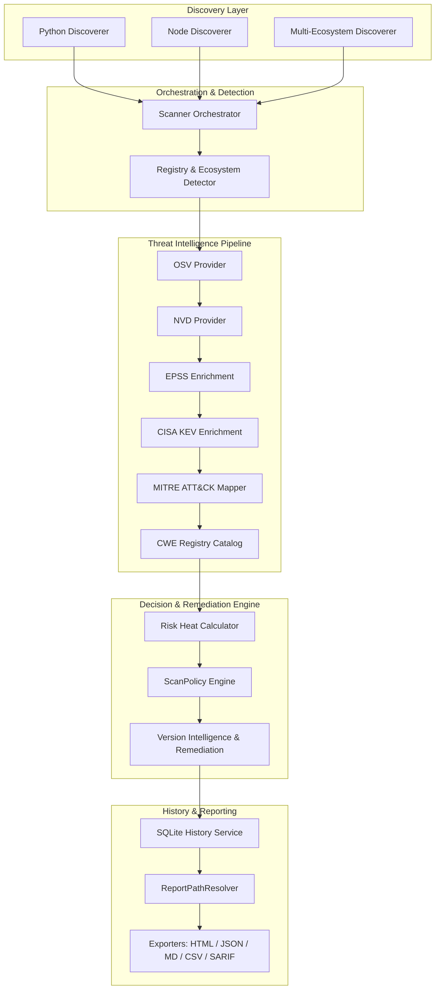

# PULSE Architecture & Component Design

PULSE CVE Scanner CLI is built around a modular, multi-tier pipeline designed for speed, resilience, and actionable security intelligence.

---

## High-Level Architecture Diagram

---

## Core Pipeline Subsystems

### 1. Ecosystem Discovery & Detection (`scanner.py`, `registry_detector.py`)
- Discovers installed packages or project manifests across Python, Node.js, Rust (Cargo), Go, Ruby, PHP (Composer), and Java (Maven).
- Disambiguates canonical package identities using ecosystem keys (`pypi:django`, `npm:react`).

### 2. Threat Intelligence Pipeline (`enrichment_pipeline.py`, `threat_intel/`, `cwe_registry.py`)
- Sequentially enriches findings across OSV, NVD, EPSS, CISA KEV, MITRE ATT&CK, and CWE Registry.
- Maintains local SQLite caching (`osv_cache`, `nvd_cache`, `threat_intel_cache`) to guarantee offline scanning resilience.

### 3. ScanPolicy & Risk Heat Score (`policy.py`, `risk_engine.py`)
- **ScanPolicy** acts as the single source of truth for blocking vs non-blocking findings.
- Calculates **Risk Heat Score** combining CVSS, EPSS 30-day exploit probability, and KEV active exploitation flags.

### 4. Version Intelligence & Verified Remediation (`version_intelligence/`, `command_generator.py`)
- Evaluates candidate upgrade versions against advisory ranges to reject vulnerable candidates.
- Generates exact version pinning upgrade commands (`pip install Django==6.1`).

### 5. Centralized Report Path Resolver & Exporters (`path_resolver.py`, `reporter.py`, `report_service.py`)
- **ReportPathResolver** resolves target directories using strict precedence (`explicit_path` $\rightarrow$ `REPORT_CUSTOM_DIR` $\rightarrow$ `~/Documents/PULSE Reports/`).
- Appends date and time timestamps (`report_YYYYMMDD_HHMMSS.html`) to prevent accidental overwrites.
- Supports HTML, JSON (Schema 2.0), Markdown, CSV, SARIF, and CycloneDX SBOM formats.
