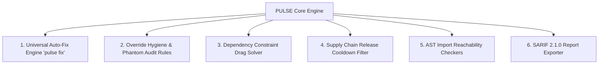

# Comprehensive Architectural Evaluation: PULSE vs. OWASP CVE Lite CLI

## Executive Summary

This report provides an in-depth comparative analysis between **PULSE Security Scanner** and **OWASP CVE Lite CLI** (`E:\Claude_project\zip\cve_lite\cve-lite-cli-main`).

While OWASP CVE Lite CLI excels as a developer-centric lockfile remediation tool specifically tailored for the JavaScript/TypeScript ecosystem (`npm`, `pnpm`, `Yarn`, `Bun`), **PULSE** is a universal **Technology Intelligence Platform** scanning across 25+ package ecosystems, live web applications, network infrastructure, and multi-source threat intelligence feeds (OSV, NVD, EPSS, CISA KEV, CWE, ATT&CK).

This evaluation highlights PULSE's key competitive advantages, identifies area-specific gaps, and outlines actionable feature recommendations to elevate PULSE to the industry standard for CLI security tooling.

---

## 1. Feature Matrix Comparison

| Capability / Feature | PULSE | OWASP CVE Lite CLI | Analysis & Comparison |
| :--- | :---: | :---: | :--- |
| **Package Ecosystem Support** | 🚀 **25+ Ecosystems** | ⚠️ JS/TS Only (4) | PULSE supports Python, JS, Rust, Go, Ruby, PHP, Java, .NET, Swift, Dart, Elixir, IaC, System PKGs, etc. |
| **Web Technology Fingerprinting** | ✅ **Declarative Engine** | ❌ None | PULSE scans live HTTP headers, cookies, HTML, meta tags, and script URLs. |
| **Network & Port Scanning** | ✅ **Built-in Scanner** | ❌ None | PULSE scans live network endpoints, open ports, and banners. |
| **Vulnerability Sources** | 🚀 **Multi-Source** | ⚠️ OSV Only | PULSE integrates OSV, NVD, EPSS probabilities, CISA KEV active exploitation flags, CWE, and ATT&CK. |
| **CPE 2.3 Correlation** | ✅ **Full Mapping** | ❌ None | PULSE maps packages & technologies to CPE 2.3 identifiers. |
| **Interactive Terminal TUI** | ✅ **Rich/Textual UI** | ⚠️ Standard CLI | PULSE provides an interactive dashboard with live progress and scan history database browsing. |
| **Copy-and-Run Fix Commands** | ✅ Yes | ✅ Yes | Both tools generate executable package manager upgrade commands. |
| **Auto-Fix Mode (`--fix`)** | ⚠️ Partial / Command | ✅ **Full Auto-Apply** | CVE Lite automatically updates lockfiles and rescans; PULSE can add `pulse fix`. |
| **Override Hygiene Auditing** | ❌ None | ✅ **11 Audit Rules** | CVE Lite flags stale/orphaned `overrides` or `resolutions` in JS lockfiles. |
| **Constraint Drag / Version Drag**| ❌ None | ✅ **DM001 Signal** | CVE Lite detects when direct dependencies block transitive CVE upgrades behind major versions. |
| **Release Cooldown Safety** | ❌ None | ✅ **Cooldown Gate** | CVE Lite checks publish dates against `.npmrc` cooldown to avoid compromised zero-day releases. |
| **AST Source Import Scanning** | ❌ None | ✅ **Reachability** | CVE Lite checks if vulnerable packages are actually imported in JS/TS source code. |
| **SARIF Format Exporter** | ❌ None | ✅ **SARIF Standard** | CVE Lite exports `.sarif` for native GitHub Code Scanning integration. |

---

## 2. PULSE Core Strengths (What PULSE Does Best)

1. **Universal Technology Intelligence Across Domains**:
   PULSE is not limited to a single programming language or package manager. It seamlessly scans application dependencies (Python, JS, Rust, Go, Java, .NET, C/C++, Swift, Elixir), infrastructure code (Terraform, Helm), container images, system packages (Debian, Alpine), and live web targets.

2. **Actionable Exploit & Threat Context**:
   Unlike single-source vulnerability scanners, PULSE enriches every finding with **EPSS** (probability of exploitation in the wild within 30 days), **CISA KEV** (confirmed active exploitation in attack campaigns), **CWE** (flaw categorization), and **MITRE ATT&CK** (tactics & techniques).

3. **Historical Scan Database & State Persistence**:
   PULSE persists scan results, deduplicated findings, and report artifact paths in SQLite, allowing security teams to query past scans, analyze trends, and inspect report history offline.

---

## 3. Key Gaps & Opportunities in PULSE (What to Add/Improve)

### Gap 1: Automated Multi-Ecosystem Auto-Fix Engine (`pulse fix`)
* **What CVE Lite does**: Allows running `cve-lite --fix` to automatically execute package manager upgrade commands (`npm install`, `pnpm add`) and rescan.
* **PULSE Recommendation**: Create a `PulseFixEngine` that executes verified safe upgrades across ecosystems (`pip install --upgrade`, `npm update`, `cargo update`, `go get -u`) with dry-run support.

### Gap 2: Dependency Override & Resolution Hygiene Checker
* **What CVE Lite does**: Implements 11 linting rules (`OA001`–`OA009`, `PD001`–`PD002`) catching orphaned overrides, floating tags, surpassed pins, and phantom dependencies.
* **PULSE Recommendation**: Add an `OverrideHygieneAuditor` module in `src/pulse/ecosystems/` to audit `overrides`, `resolutions`, `[patch]`, and `replace` directives in JS, Rust, Go, and Python dependency manifests.

### Gap 3: Constraint Drag & Version Lock Analysis
* **What CVE Lite does**: Identifies when a vulnerable transitive dependency cannot be updated because a direct parent dependency enforces an restrictive version constraint (surfacing major-version upgrade blockers).
* **PULSE Recommendation**: Enhance `discover_dependency_edges()` to calculate dependency tree depth and highlight "Constraint Drag" dependencies in terminal reports.

### Gap 4: Supply Chain Release Cooldown Gate
* **What CVE Lite does**: Reads `.npmrc` / `.yarnrc` cooldown settings (`min-release-age`) and warns developers if a recommended fix version was published within the danger window (protecting against hijacked releases).
* **PULSE Recommendation**: Add a publish-age timestamp validation check to `VerifiedUpgradeRecommendation` to flag recently published package releases.

### Gap 5: AST Source Import Reachability Analysis
* **What CVE Lite does**: Scans source files to verify whether a vulnerable dependency is actually imported/required in the codebase (`PD001`/`PD002`).
* **PULSE Recommendation**: Add lightweight AST regex/tree-sitter import parsers for Python (`import x`), JavaScript (`import/require`), Go (`import`), and Rust (`use`).

### Gap 6: SARIF Exporter (`--sarif`)
* **What CVE Lite does**: Generates standardized SARIF 2.1.0 output for native GitHub Actions security tab integration.
* **PULSE Recommendation**: Implement `SarifReportExporter` in `src/pulse/exporters/` to generate compliant SARIF reports alongside HTML, JSON, and CSV.

---

## 4. Architectural Enhancement Roadmap for PULSE

---

## 5. Summary Conclusion

OWASP CVE Lite CLI offers exceptional single-ecosystem developer workflow features (auto-fix, override hygiene, release cooldown, SARIF). By adopting these 6 key developer-focused capabilities into PULSE's universal multi-ecosystem platform, PULSE will deliver an unparalleled developer experience and enterprise security scanning capability.
