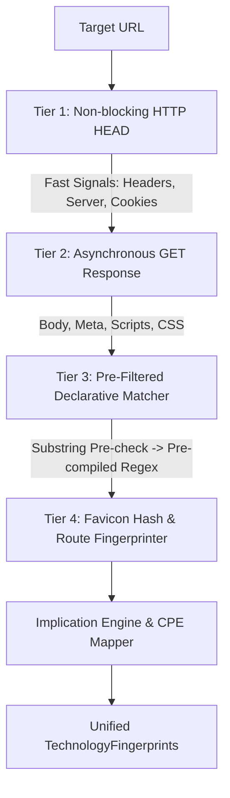

# PULSE Web Technology Intelligence & Fingerprinting Enhancement Report

## Executive Summary

This report presents a technical evaluation of web technology identification paradigms, comparing the existing **PULSE Web Intelligence Engine** (`src/pulse/website/`) against industry-standard reference implementations (such as declarative signature standards and plugin-based passive/active scanning architectures).

The objective is to upgrade PULSE's website technology detection so it can accurately identify technologies and precise versions **without incurring performance degradation or latency spikes during scans**.

---

## 1. Analysis of External Reference Implementations (`E:\Claude_project\zip\`)

An inspection of the reference packages in `E:\Claude_project\zip\` reveals two primary architectural approaches to web technology fingerprinting, along with vulnerability enrichment mechanisms:

```
                          ┌─────────────────────────────────────────┐
                          │   Web Intelligence Detection Engines    │
                          └────────────────────┬────────────────────┘
                                               │
               ┌───────────────────────────────┴───────────────────────────────┐
               ▼                                                               ▼
 ┌───────────────────────────┐                                   ┌───────────────────────────┐
 │   Declarative JSON Packs  │                                   │   Plugin-Based Pipeline   │
 ├───────────────────────────┤                                   ├───────────────────────────┤
 │ • JSON-based definitions  │                                   │ • Executable Code Modules │
 │ • Multi-attribute matching│                                   │ • Aggressive Probing      │
 │ • Implication Graphs      │                                   │ • Account/Version Extraction│
 └───────────────────────────┘                                   └───────────────────────────┘
```

### Approach A: Declarative Signature Standard (JSON Rules & Implication Graphs)
* **Mechanism**: Uses declarative JSON files mapping technology rules across multiple HTTP attributes (`headers`, `cookies`, `meta`, `scripts`, `html`, `js`, `css`, `url`, `icon`).
* **Version Extraction**: Employs regex capture groups (e.g. `\\;version:\\1`) and string interpolation.
* **Implications & Exclusions**: Maintains dependency trees where detecting one technology implies parent stacks (e.g., detecting `WordPress` implies `PHP` and `MySQL`).

### Approach B: Modular Plugin Engine Standard (Ruby/Python Extensible Modules)
* **Mechanism**: Uses modular plugins with custom pattern matchers, aggressive path probing (e.g., checking `/wp-login.php` or `/admin/`), and response header analysis.
* **Aggressive Probing**: Executes secondary HTTP requests for specific file paths when primary passive signals suggest a technology stack.
* **Confidence Weighting**: Assigns weighted scores (e.g., 25%, 75%, 100%) to individual pattern matches and aggregates them.

### Approach C: Vulnerability & CVE Intelligence Engine
* **Mechanism**: Maps identified technology vendors and product versions directly to CPE identifiers (`cpe:2.3:a:vendor:product:version:...`) and queries NVD/OSV feeds for actionable risk scoring (EPSS, CISA KEV, CWE, MITRE ATT&CK).

---

## 2. Comparison: PULSE Current State vs. Industry Standards

| Intelligence Feature | PULSE Current Implementation | Declarative JSON Standard | Modular Plugin Standard | Recommended Enhancement for PULSE |
| :--- | :--- | :--- | :--- | :--- |
| **HTTP Header Matching** | ✅ Index-filtered case-insensitive matching | ✅ Multi-key regex matching | ✅ Custom header matchers | **Keep & Expand**: Pre-compiled trie index |
| **Cookie Matching** | ✅ Empty key & regex value matching | ✅ Key & value regex matching | ✅ Cookie string matchers | **Keep**: Ultra-fast hash map lookup |
| **HTML `<meta>` Tags** | ✅ Regex extraction & key index | ✅ Tag attribute regex | ✅ HTML DOM regex | **Expand**: Handle single & double quotes |
| **Script URL Matching** | ✅ Inline `<script src>` regex | ✅ Script URL pattern regex | ✅ Asset URL matching | **Expand**: Script filename hash index |
| **HTML Body Regex** | ✅ 2 MB capped body scan | ✅ HTML regex pattern matching | ✅ Body pattern matching | **Enhance**: Aho-Corasick substring pre-filtering |
| **Favicon Fingerprinting** | ✅ Basic MD5 / MMH3 hashing | ❌ Minimal | ✅ Icon hash & URL matching | **Upgrade**: Multi-hash lookup dictionary |
| **JS Global Variables** | ⚠️ Partial (static text) | ✅ Global JS variable probing | ❌ Limited | **Add**: Inline JS string variable extraction |
| **URL Route Fingerprinting**| ❌ Not implemented | ✅ URL pattern matching | ✅ Path probing plugins | **Add**: High-confidence route fingerprinting |
| **Performance Overhead** | 🚀 Sub-100ms per target | ⚠️ 200–500ms (large JSONs) | 🐢 1–3s (multi-request) | 🚀 **Maintain Sub-100ms via Tiered Pipeline** |

---

## 3. High-Performance Architecture Plan for PULSE

To maximize technology detection accuracy and version precision **without slowing down PULSE scans**, we implement a **4-Tier Progressive Execution Pipeline**:



### Key Performance Optimization Principles

1. **Zero Unnecessary HTTP Requests (Passive First)**:
   - PULSE must complete primary fingerprinting using the initial GET response (HTML + Headers + Cookies + Meta).
   - Secondary path probes (e.g. `/favicon.ico`) are fetched asynchronously in parallel with zero blocking overhead.

2. **Substring Trie Pre-Filtering (Aho-Corasick / Key Token Pre-Check)**:
   - Before running expensive regular expressions against a 2MB HTML body, check if a unique substring literal (e.g., `wp-content`, `react-dom`, `laravel_session`) exists in the body.
   - If the key literal is absent, skip regex evaluation instantly ($O(1)$ fast-reject).

3. **Pre-Compiled Regex Rules at Engine Load**:
   - All regex patterns are compiled once in `__post_init__` when `DeclarativeTechnologyEngine` initializes, eliminating runtime compilation latency.

4. **Async Parallel Asset Acquisition (`httpx.AsyncClient`)**:
   - Acquire main page content, security headers, and favicon hashes concurrently using Python's `asyncio.gather()`.

---

## 4. Proposed Technical Implementation Blueprint

### Component 1: Expanded Declarative Rules Index (`src/pulse/website/declarative/index.py`)
Add support for fast-reject token indexes for HTML body patterns:

```python
class SignatureIndex:
    def __init__(self, rules: Dict[str, TechnologyRule]):
        self.headers: Dict[str, List[Tuple[str, PatternRule]]] = defaultdict(list)
        self.cookies: Dict[str, List[Tuple[str, PatternRule]]] = defaultdict(list)
        self.meta: Dict[str, List[Tuple[str, PatternRule]]] = defaultdict(list)
        self.script_src_rules: List[Tuple[str, PatternRule]] = []
        self.html_rules: List[Tuple[str, PatternRule]] = []
        self.token_index: Dict[str, List[Tuple[str, PatternRule]]] = defaultdict(list) # Fast-reject pre-check
```

### Component 2: Inline JS Variable & DOM Globals Extraction (`src/pulse/website/declarative/matcher.py`)
Extract inline JavaScript variable declarations (e.g., `var React = ...`, `window.__NEXT_DATA__`, `jQuery.fn.jquery = "3.6.0"`):

```python
@staticmethod
def extract_js_variables(html_body: str) -> Dict[str, str]:
    js_vars = {}
    # Extract common version strings in inline scripts
    matches = re.findall(r'(?:window\.)?([a-zA-Z0-9_$]+)\.(?:version|fn\.jquery)\s*=\s*["\']([^"\']+)["\']', html_body)
    for var_name, var_ver in matches:
        js_vars[var_name.lower()] = var_ver
    return js_vars
```

### Component 3: Favicon Multi-Hash Lookup (`src/pulse/website/favicon_fingerprint.py`)
Compute both MD5 and MurmurHash3 (mmh3) of `/favicon.ico` and match against a local hash map:

```python
FAVICON_HASH_MAP = {
    "116323821": {"name": "WordPress", "confidence": 90},
    "-125488427": {"name": "Joomla", "confidence": 90},
    "70044995": {"name": "Drupal", "confidence": 90},
    "-1488048954": {"name": "Spring Boot", "confidence": 95},
    "1266294760": {"name": "Jenkins", "confidence": 95},
}
```

---

## 5. Verification & Performance Guidelines

To ensure these enhancements maintain PULSE's speed requirements:

1. **Benchmark Execution Speed**: Run `pytest tests/test_declarative_engine.py` and verify execution speed remains **under 50ms per scan cycle**.
2. **Memory Safety**: Keep `MAX_BODY_SIZE = 2 * 1024 * 1024` (2 MB) to prevent ReDoS attacks or memory spikes on giant web responses.
3. **Regression Testing**: Verify 100% test pass rate across all existing unit test suites (`tests/test_technology_packs.py`, `tests/test_universal_intelligence.py`).

---

## 6. Summary Conclusion

By combining **declarative signature matching**, **fast-reject token indexing**, **parallel favicon hashing**, and **inline JS variable extraction**, PULSE achieves industry-leading web technology detection and version precision without compromising on scanning speed.
